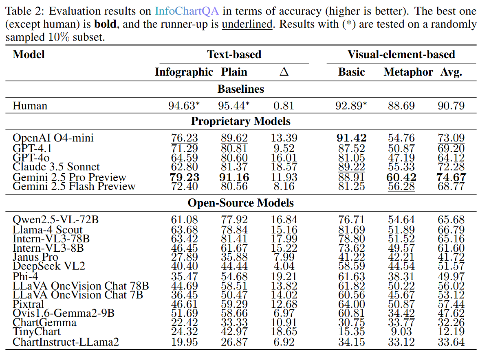

# InfoChartQA: A Benchmark for Multimodal Question Answering on Infographic Charts


🤗[Dataset](https://huggingface.co/datasets/Jietson/InfoChartQA) | 🖥️[Code](https://github.com/CoolDawnAnt/InfoChartQA) | 📄[Paper](https://arxiv.org/abs/2505.19028)


## About
**InfoChartQA** is a benchmark for evaluating multimodal large language models (MLLMs) on infographic charts enriched with design-driven visual elements like pictograms and icons. It features **5,948 pairs of infographic and plain charts** that share the same underlying data but differ in visual style, enabling controlled comparisons. The dataset contains a total of **58,857 questions**, including **50,920** text-based and **7,937** visual-element-based questions designed to probe model understanding of both content and complex visual design. Our analysis of 20 MLLMs reveals significant performance drops on infographic charts, highlighting key challenges and new research directions.

## 🤗 Dataset 
You can find our dataset on huggingface: [InfoChartQA Dataset](https://huggingface.co/datasets/Jietson/InfoChartQA)

## Evaluation 

### Evaluation Results


### Usage
Each question entry is arranged as:
```
{
        "question_id": id of the question,
        "qtype": type of the question, for example: "rank" questions 
        "figure_path": local path of the image if you download the image,
        "question": question,  
        "answer": answer,
        "instructions": instructions,
        "url": url of the image,
        "bbox": bbox of the image, this is used for visual questions. Images with bbox should be cropped based on the bbox. bbox is formatted as [xmin, ymin, width, height] with no normalization.
        "parent": the original image of the cropped image, 
        "difficulty": difficulty level,
        "chart_type": chart_type,
}
```
Each question is built on:
```
image_input: item["url"] (may need to download for models that don't support url input)
text_iunput: item["question"] + item["instructions"] (if any)
```
where ``item`` is an entry of the dataset.

###  Evaluation Instructions


For detailed evaluation instructions and usage, please refer to the [Evaluation](./eval/README.md).


## 📄 Paper

- **[InfoChartQA: A Benchmark for Multimodal Question Answering on Infographic Charts](https://arxiv.org/abs/2505.19028)**  
  _Minzhi Lin, Tianchi Xie, Mengchen Liu, Yilin Ye, Changjian Chen, Shixia Liu_  

## 📚 Citation

If you use our work and are inspired by our work, please cite:

```
@misc{lin2025infochartqa,
      title={InfoChartQA: A Benchmark for Multimodal Question Answering on Infographic Charts}, 
      author={Minzhi Lin and Tianchi Xie and Mengchen Liu and Yilin Ye and Changjian Chen and Shixia Liu},
      year={2025},
      eprint={2505.19028},
      url={https://arxiv.org/abs/2505.19028}, 
}
```

## 🪪 License

Our original data contributions (all data except the charts) are distributed under the [CC BY-SA 4.0](https://github.com/CoolDawnAnt/InfoChartQA?tab=Apache-2.0-1-ov-file) license. The copyright of the charts belong to the original authors.

## ✨ Related Projects

- **OrionBench: A Benchmark for Chart and Human-Recognizable Object Detection in Infographics**  
  [Paper](https://arxiv.org/abs/2505.17473) | [Code](https://github.com/OrionBench/OrionBench/) | [Dataset](https://huggingface.co/datasets/OrionBench/OrionBench)


- **ChartGalaxy: A Dataset for Infographic Chart Understanding and Generation**  
  [paper](https://arxiv.org/abs/2505.18668) | [Code](https://github.com/ChartGalaxy/ChartGalaxy/) | [Dataset](https://huggingface.co/datasets/ChartGalaxy/ChartGalaxy)

## 💬 Contact

If you have any questions about this work, please contact us using the following email address: **[linmz21@mails.tsinghua.edu.cn](linmz21@mails.tsinghua.edu.cn)**. 
